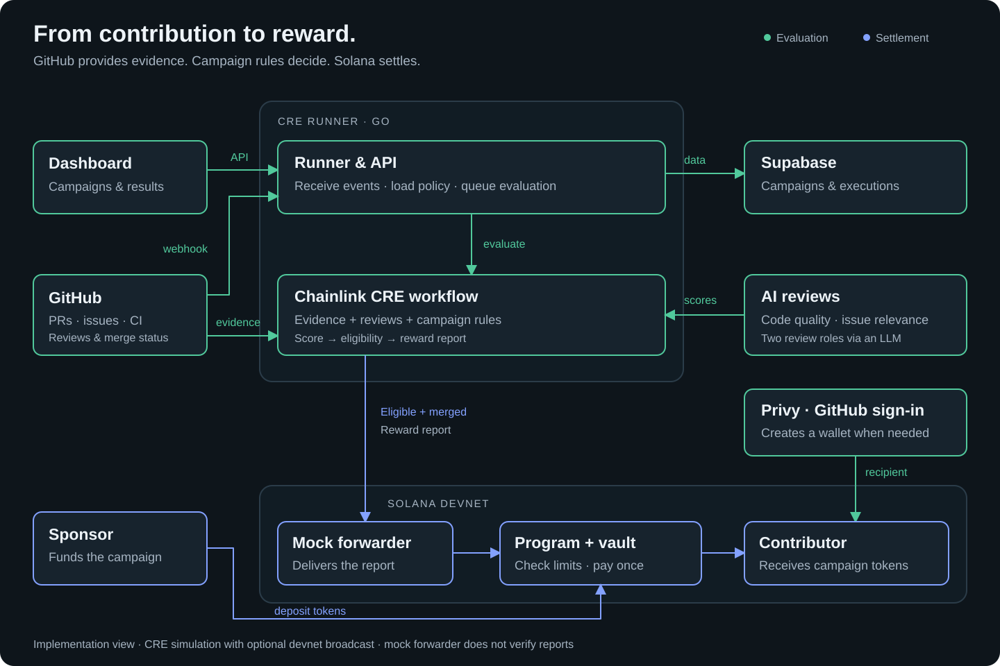

# Kudoz

**Reward contributions that matter.**

Kudoz connects GitHub contributions to rewards on Solana. Sponsors fund campaigns, contributors solve issues, and campaign rules determine which merged pull requests earn a payout.

**Contributors only need a GitHub account.** Sign in with GitHub; Kudoz automatically creates an embedded wallet through Privy when needed, so there’s no separate wallet setup.

## Watch

| Project Film | Demo |
| --- | --- |
| The idea behind Kudoz. | The product, from pull request to payout. |
| [Watch the film](https://youtu.be/YzVUoyMnH0U) | Coming soon. |

<!-- Replace “Coming soon.” with [Watch the demo](URL) when ready. -->

## How it works

1. **Fund a campaign.** Set the repository, reward rules, and budget; deposit tokens into a Solana campaign vault.
2. **Evaluate contributions.** GitHub events trigger a CRE workflow that combines PR evidence with AI reviews of code quality and issue relevance.
3. **Reward qualifying work.** Open PRs receive a preview. Eligible merged PRs trigger a payout to the contributor’s GitHub-linked Solana wallet.

## Architecture

The **runner** connects the dashboard, GitHub, and campaign data in Supabase. The **CRE workflow** calculates the score, checks eligibility, and produces the reward report. **Privy** resolves or creates the contributor’s wallet; the **Solana program** checks the payout and transfers tokens from the campaign vault.

## Why this works

- **Rules decide the reward.** AI reviews contribute to a score; the workflow applies campaign requirements such as a linked issue, passing CI, and a minimum score. Payment requires a merge.
- **Funds have boundaries.** Sponsors fund the vault in advance. The Solana program enforces the reward cap, available balance, recipient, and one payout per PR per campaign.
- **Decisions can be traced.** Scorecards explain the evaluation; an evaluation hash links the off-chain decision to its on-chain payout record.

**Current scope:** The payout and wallet integrations are implemented. The runner uses `cre workflow simulate`, with broadcasts to Solana devnet when configured. This is a hackathon prototype: the devnet mock forwarder does not verify reports, and this path does not provide decentralized CRE consensus.

## Code & setup

| Component | Location |
| --- | --- |
| Dashboard · Next.js | [cre-runner-frontend](cre-runner-frontend/) |
| Runner & CRE workflow · Go | [Setup](cre-runner/README.md) · [Deployment](cre-runner/DEPLOY.md) |
| Campaign vault & payouts · Solana / Anchor | [solana](solana/README.md) |
