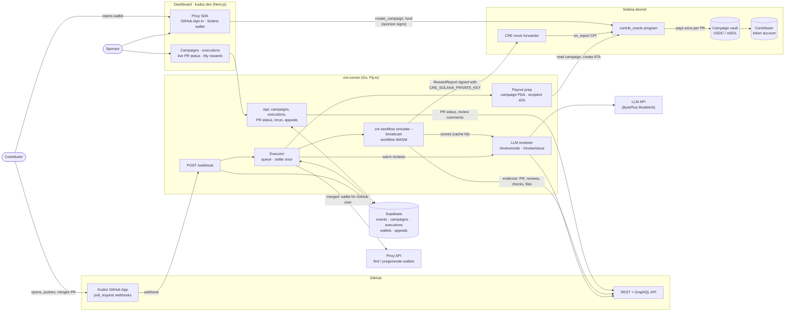
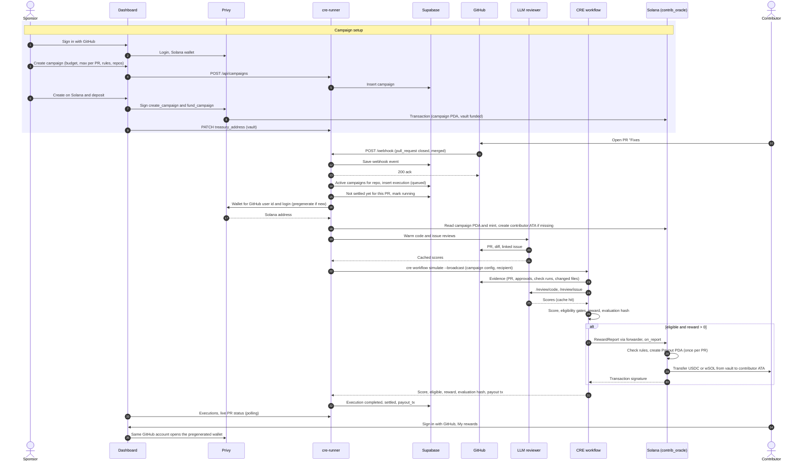

# Kudoz

> AI can generate code. Kudoz rewards the people who generate value.

[kudoz.dev](https://kudoz.dev)

Kudoz turns merged GitHub pull requests into on-chain rewards. Sponsors fund a campaign for their repositories. Every pull request is scored by a Chainlink CRE workflow from GitHub evidence and two LLM reviews. When an eligible PR is merged, the contributor is paid in USDC or SOL from the campaign's Solana treasury. That includes contributors who have never used Kudoz: they get a wallet tied to their GitHub account and claim it by signing in with GitHub.

## Architecture



## How it works

1. **Campaign.** A sponsor signs in with GitHub, creates a campaign (budget, max reward per PR, minimum score, eligibility rules, repositories) and funds its Solana vault from the dashboard.
2. **Evaluation.** Every push to an open PR runs a preview evaluation. Merging runs the paying one.
3. **Score.** The score is 40% GitHub evidence, 30% LLM code review and 30% LLM issue review.
   - Evidence: linked issue 25, CI passing 25, an approval 20, tests touched 20, size 10.
   - Code review: correctness, tests, code quality, security.
   - Issue review: does the PR resolve the linked issue, value, scope.
   - Both reviews treat PR text as untrusted input.
4. **Eligibility.** Rules the campaign can require: merged, CI passed, linked issue (`Fixes #N` in the PR description). The score must also reach the campaign's minimum.
5. **Payout.** The reward scales with the score up to the campaign's maximum per PR. The workflow writes a signed report through the CRE forwarder to the `contrib_oracle` program. The program checks the campaign rules and pays the PR author's Privy wallet. A payout record makes every PR payable only once, both on-chain and in the database.
6. **Transparency.** Each execution shows the score breakdown, evaluation hash, payout transaction, and the live PR state from GitHub. It can be re-run, or sent for human review with a comment on the PR.

## Lifecycle of a rewarded PR



## Repository

| Path | What |
| --- | --- |
| [`cre-runner/`](cre-runner) | Go service on Fly: webhook intake, dashboard API, CRE executions, LLM reviewer, Privy and Solana payout prep. [README](cre-runner/README.md), [API](cre-runner/API.md), [deploy guide](cre-runner/DEPLOY.md) |
| [`cre-runner/cre/`](cre-runner/cre) | The Chainlink CRE workflow (Go → WASM): evidence, scoring, reward, Solana report |
| [`cre-runner-frontend/`](cre-runner-frontend) | Next.js dashboard: repositories, campaigns, executions, wallet sign-in, campaign treasury |
| [`solana/`](solana) | Anchor program `contrib_oracle`: campaign vaults, forwarder-authenticated payouts. [README](solana/README.md) |

## Stack

Chainlink CRE · Solana (Anchor, devnet) · Privy (GitHub sign-in, embedded and pregenerated wallets) · Supabase · Go · Next.js · any OpenAI-compatible LLM (default BytePlus ModelArk).

## Getting started

Follow [`cre-runner/DEPLOY.md`](cre-runner/DEPLOY.md):

1. Supabase migrations.
2. Fly secrets.
3. GitHub App.
4. Privy.
5. Deploy the Solana program.
6. Configure the frontend.

For local development:

```bash
cd cre-runner && cp .env.example .env && go run .        # API + webhooks on :8080
cd cre-runner-frontend && pnpm install && pnpm dev       # dashboard on :3000
```

## Status

A hackathon build, not production.

- **Simulation, not a DON.** The workflow runs with `cre workflow simulate --broadcast`: real payouts on Solana devnet, but no decentralized consensus.
- **Mock forwarder.** The devnet forwarder doesn't verify DON signatures. Keep devnet campaigns small. Production needs the keystone forwarder and a pinned workflow owner.
- **Devnet only.** Reward tokens are fixed to devnet USDC (`4zMMC9srt5Ri5X14GAgXhaHii3GnPAEERYPJgZJDncDU`) and wrapped SOL.
- **Unauthenticated API.** The dashboard requires a signed-in wallet to manage campaigns, but the API doesn't verify it yet.
